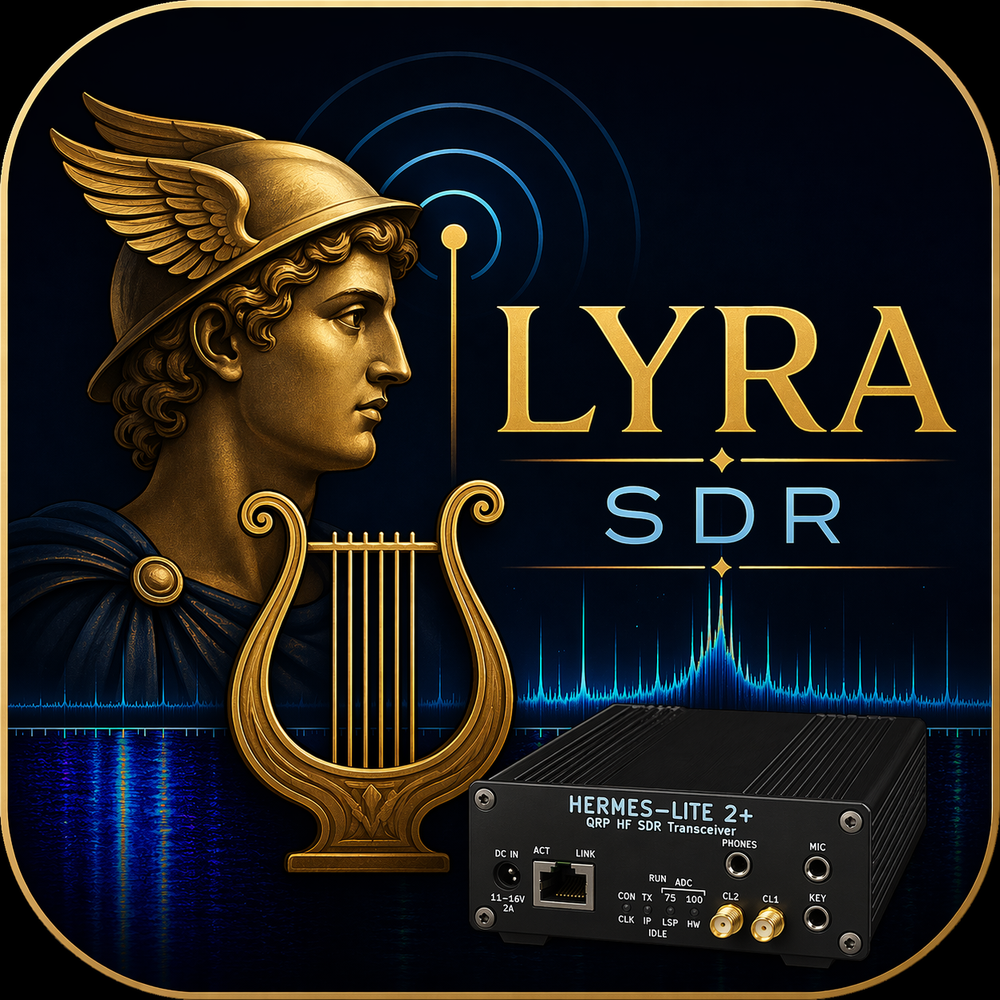

# Lyra — Qt6 SDR Transceiver for Hermes Lite 2 / 2+

**Current version: 0.0.8 — "Quiet & Polish Pass"**

Modern PySide6 desktop SDR for Steve Haynal's Hermes Lite 2 and HL2+.
Native Python HPSDR Protocol 1, TCI v1.9 server, glassy UI with
analog-look meters, a band-plan overlay with landmark click-to-tune,
GPU-accelerated panadapter + waterfall, a CW-focused audio toolkit
(APF audio peaking filter + BIN binaural pseudo-stereo), and a deep
noise-toolkit drawing on Warren Pratt's WDSP — adaptive line
enhancer, Martin-statistics MMSE-LSA noise reduction, all-mode
squelch.  Built-in weather alerts watch the operator's local
conditions across multiple data sources (Blitzortung, NWS, Ambient,
Ecowitt) and raise toolbar + toast notifications for lightning and
high-wind events.



## Status

Pre-alpha — RX is functional; TX is in progress. Developed and tested
against a Hermes Lite 2+ board.

The version string above is the single source of truth maintained in
`lyra/__init__.py` and surfaces in:

- The window title bar
- The Help → About Lyra dialog
- A permanent label on the right side of the status bar
- The User Guide's About section (rendered live from package metadata)

Bumping the version is a one-line edit in `lyra/__init__.py`; every
display surface follows automatically.

## Latest release — see [CHANGELOG.md](./CHANGELOG.md)

The current release is **0.0.8 — "Quiet & Polish Pass"**
(2026-05-02), a substantial DSP + UX upgrade on top of v0.0.7.
Headline changes:

- **Audio quiet pass.**  Per-sample AGC envelope (eliminates the
  loud block-boundary pops), decimator state preservation across
  freq / mode change (eliminates tune-clicks), AK4951 sink-swap
  fade-out.  See `docs/architecture/audio_pops_audit.md`.
- **Notch v2.**  Manual notches finally kill carriers across
  their visible width.  Operator-controllable depth (default
  −50 dB), cascade integer (1-4 stages, sharper shoulders),
  3-preset profile (Normal / Deep / Surgical), saved notch banks
  ("My 40m setup"), click-free coefficient-swap crossfade.  See
  `docs/architecture/notch_v2_design.md`.
- **Click-to-tune v1.**  Shift+click snaps to the nearest spectrum
  peak; hover preview reticle shows the snap target before commit;
  click-and-drag pans across a band end-to-end.
- **NR-stack hardening (post-v0.0.7 work merged in).**  NR2 FFT
  bump from 256 → 1024 (cleaner voice formants), captured-profile
  + NR2 fixed (Wiener-from-profile path), DSP chain order corrected
  (LMS → ANF → SQ → NR → APF), LMS slider rebuilt with real
  perceptual swing, ANF/SQ vectorized, captured-profile staleness
  toast.

For the full version history (0.0.3 → 0.0.8), see
[CHANGELOG.md](./CHANGELOG.md).

See `docs/help/getting-started.md` for the full guided tour or press
F1 inside the app for the in-app User Guide.

## Features so far

**RX signal chain**
- Native HPSDR P1 discovery + streaming (UDP, port 1024)
- Spectrum-correct panadapter (HL2 baseband mirror correction applied)
- AGC with Fast / Medium / Slow / Auto / Custom profiles
- Per-band auto-LNA (overload-protection mode, capped +31 dB)
- Manual notch filters — multi-notch, per-notch Q, live cut-depth
  visualization on the spectrum
- Spectral-subtraction noise reduction (Light / Medium / Aggressive)
- Noise-floor reference line with auto-threshold feeding AGC
- Passband overlay with draggable edges for live RX BW tweaks
- Peak markers (Line / Dots / Triangles, in-passband only)

**Bands and modes**
- IARU regional band plans (US / R1 / R3 / NONE)
- Colored sub-band segments + FT8 / FT4 / WSPR / PSK landmark
  triangles — click a triangle to tune and switch modes
- SSB (USB/LSB), CW, AM, FM, DIGU / DIGL

**UI**
- Docked-panel workspace (drag to float / tab / reset layout)
- Analog S-meter with LED-bar alternative (right-click to switch)
- Waterfall with eight palettes (Classic / Inferno / Viridis /
  Plasma / Rainbow / Ocean / Night / Grayscale)
- Click-label color picker in Settings → Visuals (text of each field
  painted in that field's current color + bolded for at-a-glance
  configuration view)
- Optional OpenGL rasterization backend so resize/fullscreen doesn't
  pause audio
- Y-axis drag-to-rescale on the spectrum's right edge
- Two-way sync between front-panel View sliders and Settings

**Integration**
- TCI v1.9 server — drives SDRLogger+, DX clusters, CAT clients
- DX spot rendering with age fade and multi-row collision packing
- Per-session notch bank, per-band frequency memory

**Audio out**
- AK4951 (HL2's onboard codec) or PC soundcard
- Automatic fallback when the stream rate exceeds AK4951's 48 kHz

## Stack

- **UI:** PySide6 (Qt6)
- **Protocol:** Native Python HPSDR Protocol 1 (UDP, port 1024)
- **DSP:** NumPy / SciPy (C++ core via pybind11 planned post-RX-stable)
- **Control:** TCI v1.9 server
- **Audio:** sounddevice (portaudio), optional AK4951 passthrough via
  the HL2's EP2 frames
- **Target OS:** Windows-first

## Running from source

Requires Python 3.11+ on Windows.

**Quickstart:**

```
pip install -r requirements.txt
python -m lyra.ui.app
```

Or double-click `LYRA.bat`.

**Step-by-step install for non-developer testers:**
see [`INSTALL.md`](INSTALL.md) — covers Python installation, Git
setup, dependency install, common gotchas, and feedback channels.
A printable Word version is also at
[`docs/Lyra-SDR-Install-Guide.docx`](docs/Lyra-SDR-Install-Guide.docx).

On first launch, Lyra tries to discover an HL2 on the local network.
If the board is reachable it'll show up in the connection panel; if
not, check firewall, cabling, and that the HL2 has power. Full
troubleshooting guide in the in-app User Guide (press **F1**).

## Hardware references

- Hermes Lite 2: http://hermeslite.com/
- Hermes Lite 2+: https://www.hermeslite2plus.com/

## Relationship to Thetis / WDSP / openHPSDR

Lyra v0.0.5 and earlier (under MIT) were a clean-room implementation
referencing only protocol documentation and operator-visible UI
behavior — no Thetis source was incorporated.

Starting with v0.0.6 (under GPL v3 or later), Lyra is in full
license compatibility with the openHPSDR ecosystem. Future releases
may directly incorporate or link with GPL'd ham-radio libraries
(notably WDSP for PureSignal, CESSB, and advanced TX). All such
incorporations preserve upstream copyright + GPL terms; see
`NOTICE.md` for ongoing third-party disclosures.

ExpertSDR3 is closed-source commercial software from Expert
Electronics — referenced from published manuals as a design
inspiration only, no code involvement.

## Backlog

Tracked in `docs/backlog.md`. High-priority open items: TX path,
per-band notch memory, neural NR integration, installer for beta
testers.

## License

**GNU General Public License v3.0 or later** — see `LICENSE`.

Lyra was originally released under the MIT License up through
**v0.0.5 ("Listening Tools")**. Starting with v0.0.6, Lyra is
relicensed under **GPL v3 or later** to match the licensing of the
broader openHPSDR / WDSP ecosystem and to enable future integration
with WDSP-based features (PureSignal, CESSB, advanced TX). Past
releases (≤ v0.0.5) remain under their original MIT terms; the
relicense applies only to v0.0.6 and later.

What this means in practice:

- You can use Lyra for any purpose, including commercial use
- You can modify Lyra freely
- You can redistribute Lyra and your modifications — but the result
  must also be GPL v3 (or later), and you must make source available

What it does NOT change:

- Donations are still welcome (PayPal, etc.) — GPL doesn't restrict
  receiving payment for the project
- Operators can run Lyra free of charge, no strings attached
- The complete source remains public on GitHub

For the canonical GPL v3 text, see `LICENSE` in this repository or
<https://www.gnu.org/licenses/gpl-3.0.html>.

© 2026 Rick Langford (N8SDR)
